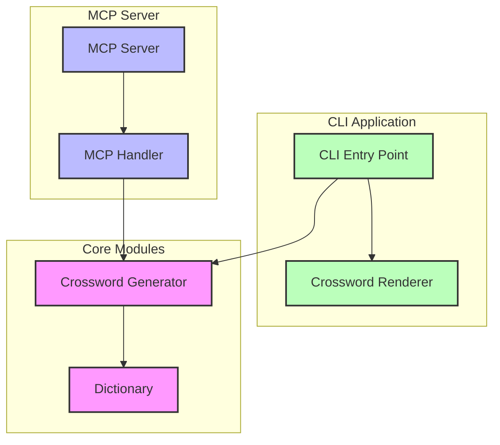

# 🎮 GoCrossword


[](https://hub.docker.com/r/ahboujelben/go-crossword-cli)
[](https://hub.docker.com/r/ahboujelben/go-crossword-mcp)

## 🧩 Overview

GoCrossword is a powerful crossword toolkit that creates engaging crossword puzzles from scratch! The system fills an empty grid with words from a predefined dictionary.

**✨ Features:**

- 🎲 Create random or seeded crossword grids with interesting words
- 🔌 MCP (Model Context Protocol) server for AI assistant integration
- 🐳 Docker support for easy deployment

## 🚀 Quick Start

**Prerequisites:** Docker

```shell
# Generate a default 13x13 crossword
docker run --rm ahboujelben/go-crossword-cli

# Generate a custom size crossword
docker run --rm ahboujelben/go-crossword-cli -rows=7 -cols=7

# Generate with a specific seed
docker run --rm ahboujelben/go-crossword-cli -rows=10 -cols=10 -seed=12345

# Use compact rendering
docker run --rm ahboujelben/go-crossword-cli -compact
```

### Building from Source (Optional)

If you prefer to build from source, you'll need Go 1.24+:

```shell
git clone https://github.com/ahboujelben/go-crossword.git
cd go-crossword
make build-cli
./go-crossword-cli
```

## 💻 CLI Options

```shell
Usage: go-crossword-cli [options]

Options:
  -rows int            Number of rows in the crossword grid (default 13)
  -cols int            Number of columns in the crossword grid (default 13)
  -seed int            Seed for crossword generation (default: random)
  -compact             Use a more compact rendering style
  -threads int         Number of goroutines to use (default 100)
```

## 📸 Examples

### Generate a random 13x13 crossword grid


### Generate a random crossword grid with custom dimensions


### Generate with compact rendering


## 🔌 MCP Server

The MCP server enables AI assistants to use the go-crossword generation engine. The AI assistant can then generate its own clues for the words.

### Integration

```shell
{
  /// The name of your MCP server
  "go-crossword": {
    /// The command which runs the MCP server
    "command": "docker",
    /// The arguments to pass to the MCP server
    "args": ["run","--rm","-i","ahboujelben/go-crossword-mcp"],
  }
}
```

https://github.com/user-attachments/assets/a052e609-3eb8-414e-947a-69d7e2915f44

## 🧠 How It Works

GoCrossword uses a sophisticated algorithm to generate crossword puzzles:

1. **Grid Generation**: Creates a grid of the specified dimensions
2. **Word Placement**: Places words from a dictionary into the grid, ensuring proper intersections
3. **Rendering**: Outputs the crossword in polished text format for easy reading or printing

### Architecture Diagram



## 🛠️ Development

### Project Structure

```text
go-crossword/
├── cli/           # Command-line interface
├── mcp/           # MCP server for AI assistant integration
├── modules/       # Core modules (crossword, dictionary)
└── Makefile       # Build and run targets
```

## 📄 License

This project is licensed under the MIT License - see the LICENSE file for details.

## 🙌 Contributing

Contributions are welcome! Feel free to open issues or submit pull requests.

---

**Made with ❤️ by ahboujelben** | Powered by Go
