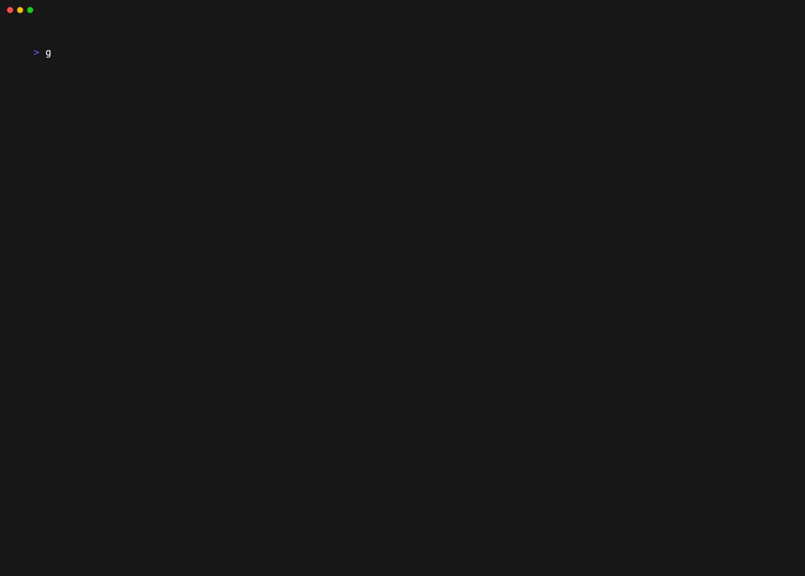

# GoCrossword

GoCrossword is a crossword generator that starts with an empty crossword grid and fills it with words from a predefined dictionary. It can optionally use an [Ollama](https://github.com/ollama/ollama) LLM model (`llama3.1:8b` by default) to make up clues for each of the crossword words.

## Getting started

The program is written in Go and can be run from source using:

```shell
go run github.com/ahboujelben/go-crossword@latest
```

The command above will create a randomly-generated 13x13 crossword grid.

To complement it with clues, an Ollama server running locally with a suitable model like llama3.1:8b is required.

The generated crosswords are shown solved by default. This mode is primarily for those who wish to create crosswords for others to solve. Alternatively, if run with `-unsolved` flags, the solution will be hidden.

Each program invocation will create a new random crossword grid, unless a `-crossword-seed` is specified. Similarly, each invocation will also generate a random set of clues, unless a `-clues-seed` is specified.

## Examples

### Generate a random 13x13 crossword grid


Note the seed printed at the end can be used to generate clues for that specific crossword.

### Generate a random crossword grid with custom dimensions


### Generate a crossword with clues in solved mode


The example above shows how clues are generated for a specific seeded crossword. If the seed is omitted, a random crossword grid is created along with the clues.

The clues are issued by default by querying Ollama on `http://localhost:11434` and using `llama3.1:8b` model. Both these could be passed as arguments via `-ollama-url` and `-ollama-model`.

Note that the second seed `-clues-seed` allows recreating that crossword later with those exact clues.

#### Cryptic clues

By default, the clues should yield a crossword of normal/easy difficulty. Passing `-cryptic` will prompt the LLM model to come up with more cryptic clues.



### Unsolved mode

Passing `-unsolved` will hide the solution of the generated crossword. This can apply to previously generated crosswords (when the crossword/clues seed values are passed) or a new random one.


If a random unsolved crossword is generated, the solution can be shown by rerunning the command with the printed seeds.


