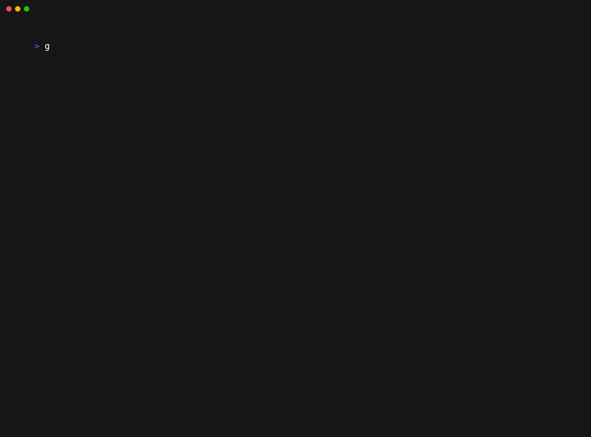
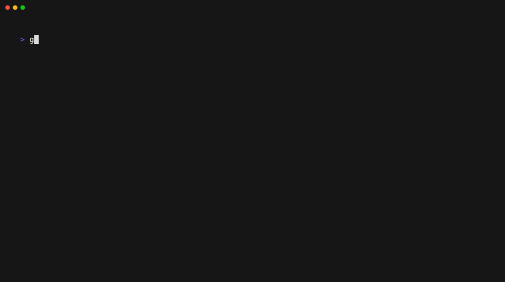

# 🎮 GoCrossword


## 🧩 Overview

GoCrossword is a powerful crossword toolkit that creates engaging crossword puzzles from scratch! The system fills an empty grid with words from a predefined dictionary and can generate clever clues using AI.

**✨ Features:**

- 🎲 Create random or seeded crossword puzzles
- 🤖 AI-powered clue generation with [Ollama](https://github.com/ollama/ollama)
- 🖥️ CLI tool for quick puzzle creation
- 🐳 Docker support for easy deployment

## 🚀 Quick Start

### Prerequisites

- Go 1.24 or higher
- [Ollama](https://github.com/ollama/ollama) running locally with `llama3:8b` model (for clue generation)

### Installation

```shell
# Clone the repository
git clone https://github.com/ahboujelben/go-crossword.git
cd go-crossword

# Build the CLI tool
make build-cli
```

## 💻 CLI Usage

The CLI tool allows you to quickly generate crossword puzzles for printing or sharing.

```shell
# Run using the CLI executable
./go-crossword-cli

# Or use the Make target
make run-cli

# Docker Compose option (ollama running withing docker)
make docker-compose-cli

```shell
### Docker Compose Examples

# Generate a custom size crossword
make docker-compose-cli ARGS="-rows 10 -cols 10"

# Generate a compact rendering
make docker-compose-cli ARGS="-compact"
```

### CLI Options

```shell
Usage: go-crossword-cli [options]

Options:
  -rows int            Number of rows in the crossword grid (default 13)
  -cols int            Number of columns in the crossword grid (default 13)
  -crossword-seed int  Seed for crossword generation (default: random)
  -clues-seed int      Seed for clue generation (default: random)
  -unsolved            Display puzzle in unsolved mode
  -cryptic             Generate more cryptic/challenging clues
  -ollama-url string   URL of the Ollama server (default "http://localhost:11434")
  -ollama-model string Model to use for generating clues (default "llama3:8b")
  -compact             Use a more compact rendering style
```

### CLI Examples

#### Generate a random 13x13 crossword grid



Note the seed printed at the end can be used to generate clues for that specific crossword.

#### Generate a random crossword grid with custom dimensions



#### Generate a crossword with clues in solved mode


The example above shows how clues are generated for a specific seeded crossword. If the seed is omitted, a random crossword grid is created along with the clues.

Note that the second seed `-clues-seed` allows recreating that crossword later with those exact clues.

#### Cryptic clues

By default, the clues should yield a crossword of normal/easy difficulty. Passing `-cryptic` will prompt the LLM model to come up with more cryptic clues.


#### Unsolved mode

Passing `-unsolved` will hide the solution of the generated crossword. This can apply to previously generated crosswords (when the crossword/clues seed values are passed) or a new random one.


If a random unsolved crossword is generated, the solution can be shown by rerunning the command with the printed seeds.


## 🤖 Ollama Integration

GoCrossword uses [Ollama](https://github.com/ollama/ollama) to generate clever and engaging clues for your crosswords.

### Setup Ollama

1. Install Ollama from [https://ollama.com/](https://ollama.com/)
2. Pull the default model:

   ```shell
   ollama pull llama3:8b
   ```

3. Start the Ollama server:

   ```shell
   ollama serve
   ```

### Docker Setup

You can run the CLI tool in Docker using:

```shell
make docker-run-cli
```

## 🧠 How It Works

GoCrossword uses a sophisticated algorithm to generate crossword puzzles:

1. **Grid Generation**: Creates a grid of the specified dimensions
2. **Word Placement**: Places words from a dictionary into the grid, ensuring proper intersections
3. **Clue Generation**: Uses Ollama's LLM capabilities to create engaging clues for each word
4. **Rendering**: Outputs the crossword in text format for CLI display

### Architecture Diagram


## 🛠️ Development

### Project Structure

```text
go-crossword/
├── cli/           # Command-line interface
├── modules/       # Core modules (crossword, dictionary, clue generation)
└── Makefile       # Build and run targets
```

### Available Make Commands

```bash
make build-cli                    # Build the CLI application
make run-cli                      # Run the CLI application
make test                         # Run tests
make docker-build-cli             # Build CLI Docker image
make docker-run-cli               # Run CLI Docker container
make docker-compose-cli           # Run CLI with Docker Compose
```

## 📄 License

This project is licensed under the MIT License - see the LICENSE file for details.

## 🙌 Contributing

Contributions are welcome! Feel free to open issues or submit pull requests.
